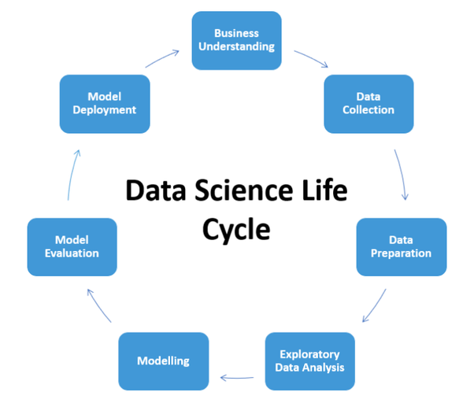

# Kaggle Competition Resources

## About

### Description

This is repository to house code, notebooks and other resources relevant to kaggle competitions.

### The Data Science Lifecycle

Each project directory should have a README.md with an high-level explanation of each of these steps

## General Interests

Domains/projects that I am generally interested in:
- Computational bioinformatics
- Physical sciences
- Sustainability technologies
- Energy technologies
- Space/astronomy
- Machine learning

## Authors

* **Dan McGonigle** [dpmcgonigle](https://github.com/dpmcgonigle)
